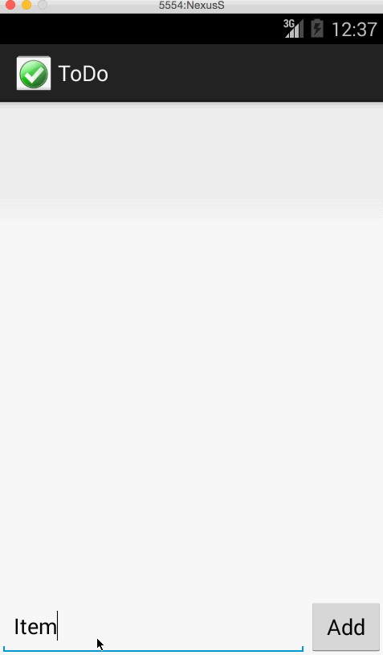

ToDo
==============

This is an Android demo application for displaying and editing the a list of todo items. 

Time spent: 1 hour spent in total

Completed user stories:

 * [x] Required: User can view a list of todo items
 * [x] Required: Tap and hold removes an item
 * [x] Optional: Can read and write items to a file
 
Notes:

The emulator and gif preview tool did not work well together and it dropped some frames which you will seee in the walkthorugh.

Walkthrough of all user stories:

